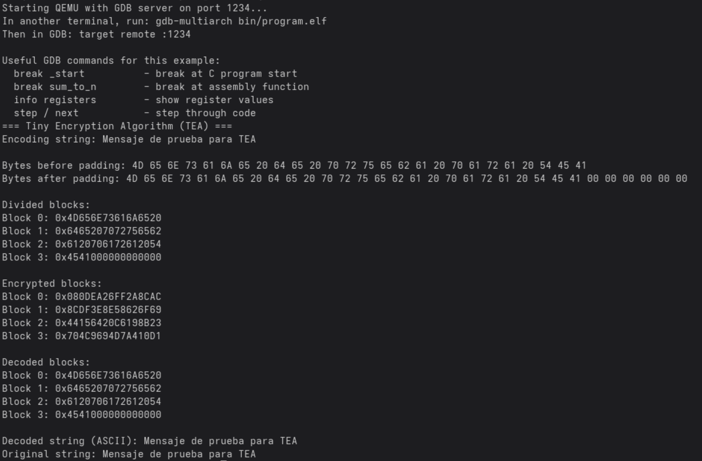

# Implementación de Cifrado TEA usando C y Ensamblador RISC-V en QEMU

Este proyecto implementa y prueba el algoritmo de cifrado Tiny Encryption Algorithm (TEA) en un entorno bare-metal RISC-V de 32 bits, separando la lógica de alto nivel en C y las rutinas criptográficas en ensamblador. Además, proporciona un entorno completo para compilar, ejecutar y depurar el sistema utilizando QEMU y GDB dentro de un contenedor Docker, facilitando la verificación de resultados y la experimentación con arquitectura RISC-V

---

## 1. Estructura del proyecto

```
.
├── bin/                # Binarios generados (.elf)
│   └── program.elf
├── build/              # Objetos compilados (.o)
│   ├── main.o
│   ├── startup.o
│   ├── tea_encrypt.o
│   └── tea_decrypt.o
├── src/                # Código fuente y linker script
│   ├── linker.ld
│   ├── main.c
│   ├── startup.s
│   ├── tea_encrypt.s
│   └── tea_decrypt.s
├── build.sh            
├── run.sh              
├── run-qemu.sh         
├── Dockerfile          
├── .gitignore
└── README.md
```

- `build.sh` script de compilación principal
- `run.sh` automatiza la construcción de la imagen y la ejecución del contenedor
- `run-qemu.sh` script para ejecutar QEMU con GDB
- `Dockerfile` define la imagen que incluye el emulador QEMU y el toolchain RISC-V

---

## 2. Descripción de la arquitectura del software

El sistema está dividido en **dos capas principales**:

- **C (alto nivel):**
  - Se encarga de gestionar la lógica principal del programa.
  - Convierte cadenas ASCII a bloques de 64 bits.
  - Maneja memoria a través de un *heap* implementado manualmente (`malloc`, `calloc`, `memcpy`) ya que no se pueden incluir librerías estándar en un entorno bare-metal.
  - Contiene funciones auxiliares para imprimir en el UART (hexadecimal, decimal, ASCII y bytes).
  - Llama a las funciones criptográficas `tea_encrypt` y `tea_decrypt`.

- **ASM RISC-V (bajo nivel):**
  - Implementa el algoritmo **TEA (Tiny Encryption Algorithm)** en funciones dedicadas.
  - Su única responsabilidad es cifrar/descifrar bloques de 64 bits recibidos como parámetros.
  - Estas funciones se exponen a C mediante `extern`.

**Interfaces utilizadas:**

- La interfaz entre C y ASM se basa en las convenciones de llamada de RISC-V (paso de punteros a arreglos de `uint32_t`).
- La comunicación con el "usuario" se hace por UART simulado en QEMU, a través de direcciones de memoria mapeadas.

**Decisiones de diseño:**

- Se optó por **Big Endian** en la representación de cadenas, ya que es más apropiado para manipular texto y simplifica la reconstrucción de strings al descifrar.
- El heap propio evita dependencias externas y asegura control completo sobre la memoria en bare-metal.

---

## 3. Funcionalidades implementadas

- Conversión de cadenas ASCII a bloques de 64 bits.
- Aplicación de **padding** para que las cadenas tengan tamaño múltiplo de 8 bytes.
- Cifrado TEA (`tea_encrypt`) en ASM sobre cada bloque.
- Descifrado TEA (`tea_decrypt`) en ASM para recuperar la información original.
- Impresión en consola UART simulada:
  - Hexadecimal (32 y 64 bits).
  - Bytes individuales.
  - Cadenas ASCII reconstruidas.
- Implementación de utilidades bare-metal:
  - Heap mínimo (`malloc`, `calloc`, `free`).
  - `strlen`, `memcpy` y funciones auxiliares.

---

## 4. Evidencias de ejecución con GDB y QEMU

Durante la ejecución, se pueden observar los resultados intermedios y finales directamente en la salida de QEMU (UART) y en la sesión de depuración con GDB.  
El siguiente caso corresponde a la cadena y clave de prueba utilizadas:

```c
str = "Mensaje de prueba para TEA";
key = {0xA1B2C3D4, 0x5E6F7788, 0x99ABCDEF, 0x01234567};
```

**Figura 1.** Ejecución del programa en QEMU mostrando la salida por UART.


**Figura 2.** Sesión de GDB conectada al servidor QEMU, inspeccionando registros y memoria.  


---

## 5. Discusión de resultados

- El sistema funcionó de manera correcta en QEMU y GDB, logrando cifrar y descifrar cadenas de longitud arbitraria.

- El uso de Big Endian permitió un manejo más natural de strings, garantizando que la reconstrucción al descifrar mantuviera el orden correcto de los caracteres.

- La implementación de un heap manual resolvió la limitación de librerías estándar y permitió trabajar con bloques dinámicos.

- La arquitectura en capas (C ↔ ASM) hizo posible mantener el ASM enfocado únicamente en la lógica criptográfica, lo que simplifica depuración y pruebas.

---

## 6. Inicio rápido

### Paso 1: Construir el contenedor

```bash
chmod +x run.sh
./run.sh
```

### Paso 2: Elegir y compilar

```bash
cd /home/rvqemu-dev/workspace
./build.sh
```

### Paso 3: Ejecutar con QEMU y depurar

```bash
# En una terminal: iniciar QEMU con servidor GDB
./run-qemu.sh

# En otra terminal: conectar GDB
docker exec -it rvqemu /bin/bash    # Si es con docker
podman exec -it rvqemu /bin/bash    # Si es con podman

cd /home/rvqemu-dev/workspace/
gdb-multiarch bin/program.elf
```

---

## 7. Uso detallado

### Construcción del contenedor

El script `run.sh` construye la imagen `rvqemu` y crea un contenedor interactivo que monta el directorio del proyecto en `/home/rvqemu-dev/workspace`.

### Compilación

El proyecto incluye un script `build.sh` que maneja la compilación automáticamente.

**Opciones de compilación utilizadas**:

- `-march=rv32im`: arquitectura RISC-V 32 bits con extensiones I y M
- `-mabi=ilp32`: ABI ILP32
- `-nostdlib -ffreestanding`: entorno bare-metal
- `-g`: información de depuración para GDB

### Ejecución y depuración

1. **QEMU**: `run-qemu.sh` inicia QEMU con servidor GDB en puerto 1234
2. **GDB**: Conectar desde otra terminal para depuración interactiva

**Comandos útiles de GDB**:

```gdb
target remote :1234    # Conectar al servidor GDB
break _start           # Punto de ruptura al inicio
continue               # Continuar ejecución
layout asm             # Vista de ensamblador
layout regs            # Vista de registros
step                   # Ejecutar siguiente instrucción
info registers         # Mostrar registros
monitor quit           # Finalizar sesión
```
